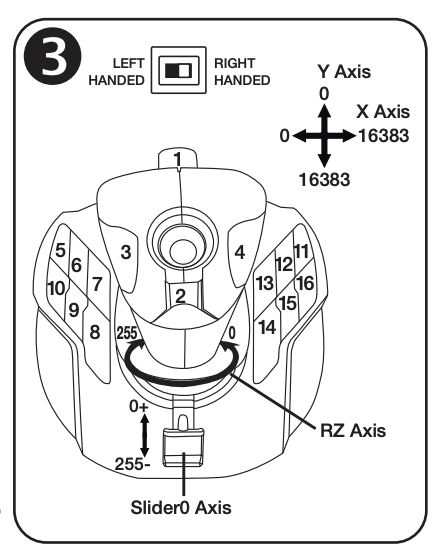

# Thrustmaster T.16000M InputDevice Class

A small JavaScript class for using a Thrustmaster T.16000M joystick in Cisco RoomOS macros. It translates RoomOS joystick events into stable, readable button and axis names and remaps the base buttons for the joystick's left- or right-handed hardware setting.

For a complete implementation, see the [Joystick Camera Control Production Switcher](https://ctg-tme.github.io/Joystick_CameraControl_ProducionSwitcher_using_Thrustmaster_16000M/). It uses this class to select cameras and control pan, tilt, and zoom from a T.16000M.



## Requirements

- A Cisco collaboration device running RoomOS with support for the InputDevice Joystick API
- A Thrustmaster T.16000M USB joystick connected to the device
- RoomOS macro access

## Install

1. Add `Thrustmaster_16000M-Class.js` to the RoomOS Macro Editor.
2. Save it with the exact macro name `Thrustmaster_16000M-Class`. It can remain inactive when another macro imports it as a dependency.
3. Import the class from your application macro:

```js
import { ThrustMaster16000M_JoyStick } from './Thrustmaster_16000M-Class';
```

## Basic usage

```js
import xapi from 'xapi';
import { ThrustMaster16000M_JoyStick } from './Thrustmaster_16000M-Class';

const joystick = new ThrustMaster16000M_JoyStick({
  handednessHardwareToggle: 'Right'
});

joystick.button.on('STICK_TRIGGER', state => {
  if (state === 'Pressed') {
    console.log('Trigger pressed');
  }
});

joystick.stick.on('MAIN_PITCH', value => {
  console.log(`Main stick pitch: ${value}`);
});

joystick.stick.on('MAIN_YAW', value => {
  console.log(`Main stick twist: ${value}`);
});

async function init() {
  await xapi.Config.Peripherals.InputDevice.Mode.set('On');

  xapi.Event.UserInterface.InputDevice.Joystick.on(data => {
    joystick.handleInput(data);
  });
}

init();
```

The class only normalizes and dispatches joystick input. Your application decides what each button or axis does, such as sending `xapi.Command.Camera.Ramp` commands.

## Handedness

Set `handednessHardwareToggle` to match the physical switch on the bottom of the joystick:

```js
const joystick = new ThrustMaster16000M_JoyStick({
  handednessHardwareToggle: 'Left'
});
```

You can change it later without recreating the class:

```js
joystick.setHandednessHardwareToggle('Right');
```

Use `Left` or `Right` in application code. The comparison is case-insensitive, and unrecognized values default to right-handed mode.

## Inputs

### Buttons

Register a callback with `joystick.button.on(name, callback)`. The callback receives the RoomOS button state, such as `Pressed` or `Released`.

| Area | Logical names |
|---|---|
| Stick | `STICK_TRIGGER`, `STICK_SOUTH`, `STICK_WEST`, `STICK_EAST` |
| Left base | `BASE_LEFT_1` through `BASE_LEFT_6` |
| Right base | `BASE_RIGHT_1` through `BASE_RIGHT_6` |

The base names describe the physical side of the joystick from the operator's perspective. The class selects the correct hardware codes for the configured handedness.

### Axes

Register a callback with `joystick.stick.on(name, callback)`. The callback receives the raw value supplied by RoomOS.

| Logical name | Physical control | RoomOS axis |
|---|---|---|
| `MAIN_PITCH` | Main stick forward/back | `Y` |
| `MAIN_ROLL` | Main stick left/right | `X` |
| `MAIN_YAW` | Main stick twist | `RZ` |
| `MINI_PITCH` | Hat/mini-stick up/down | `HAT0Y` |
| `MINI_ROLL` | Hat/mini-stick left/right | `HAT0X` |

Only one callback is stored for each logical input. Registering the same button or axis again replaces its previous callback.

## API

| Member | Purpose |
|---|---|
| `new ThrustMaster16000M_JoyStick(options)` | Creates a joystick mapper. `options.handednessHardwareToggle` may be `Left` or `Right`. |
| `button.on(name, callback)` | Registers a callback for a logical button. |
| `stick.on(name, callback)` | Registers a callback for a logical axis. |
| `handleInput(data)` | Processes one event from `xapi.Event.UserInterface.InputDevice.Joystick`. |
| `setHandednessHardwareToggle(mode)` | Changes the left/right hardware mapping. |
| `setDevMode(boolean)` | Enables or disables verbose input logging prefixed with `[TM16KM]`. |
| `listButtons()` | Prints all available logical button names to the console. |
| `listSticks()` | Prints all available logical axis names to the console. |

## Additional references

- [Developer reference](./thrustmaster16000m-developer-reference.html)
- [Camera operator guide](./ic26_thrustmaster16000m-operators-camera-guide.html)
- [Example project source](https://github.com/ctg-tme/Joystick_CameraControl_ProducionSwitcher_using_Thrustmaster_16000M)

## License

This project is licensed under the [MIT License](./LICENSE).
